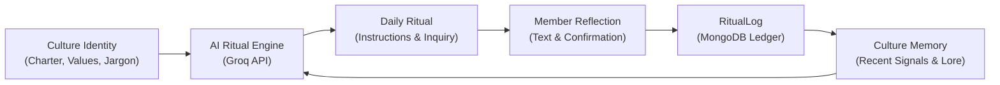

# Micro Culture

> **An adaptive social platform where communities form their own rituals, language, identity, and evolving culture.**

[](https://micro-culture.onrender.com)
[](https://micro-culture-api.onrender.com/health)
[](https://github.com/tanmayyyyayyy/micro-culture)

Micro Culture is a full-stack web application exploring how communities can develop living cultures over time. Rather than relying on generic discussion threads, members participate through daily communal rituals, reflective journaling, and a shared vernacular.

What makes Micro Culture distinct is its **adaptive memory loop**: member reflections and completion signals feed directly into the culture's historical lore. The AI does not simply emit random daily prompts—it reads recent participant momentum, respects the founding charter, and evolves tomorrow's rites to match the community's lived experience.

*Note: This is a personal portfolio project demonstrating full-stack architecture, defensive AI integration, real-time aggregate scoring, and production deployment.*

---

## 🌐 Live Deployment

- **Web Application**: [https://micro-culture.onrender.com](https://micro-culture.onrender.com)
- **REST API**: [https://micro-culture-api.onrender.com](https://micro-culture-api.onrender.com)
- **Source Code**: [https://github.com/tanmayyyyayyy/micro-culture](https://github.com/tanmayyyyayyy/micro-culture)

---

## 🧠 The AI Memory Loop

Micro Culture bridges persistent relational data with generative language models. Every culture maintains a sacred charter, a sequence of daily rituals, and a ledger of member reflections (`RitualLog`).



### How the Cycle Works
1. **Charter Formulation**: When a founder creates a culture, the AI synthesizes an initial blueprint with unique values, sacred jargon definitions, visual aesthetic keywords, and founding rites. Founders review and edit every term before publication.
2. **Daily Rite Dispatch**: Each calendar day, the system lazily generates or retrieves the day's ritual for that culture.
3. **Member Participation**: Members review step-by-step instructions, complete the ritual, and submit a reflective journal entry (`RitualLog`). Server-side duplicate checks ensure exactly one log per member per ritual per day.
4. **Context Gathering**: The engine queries the culture's charter, the last 7 daily rituals, and the last 20 member reflection logs. Private user information is strictly excluded; only names and reflection thoughts are extracted.
5. **Memory-Informed Evolution**: The AI uses participant reflections to adapt difficulty, reinforce emerging inside jokes or jargon, and choose themes that build upon recent momentum.
6. **Chronicle Synthesis**: Weekly summaries distill member highlights and crown a "Rite of the Week" based on genuine participation.

---

## ✨ Key Features

### 🏛️ Culture Creation & Blueprints
- **AI-Assisted Blueprint Generation**: Formulates cohesive aesthetic descriptors, core values, specialized jargon dictionaries, and starter rites from a brief premise and vibe tags.
- **Full Review & Fine-Tuning**: Complete editorial control over generated values, jargon definitions, symbols, and descriptions prior to database commitment.
- **Custom Visual Identities**: Distinct color accents, custom emoji emblems, and curated aesthetic keywords for every culture.

### 🕯️ Daily Rituals & Member Reflections
- **Contextual Daily Rites**: Structured rituals with titles, durations, difficulty levels, reasonings, and reflective inquiries.
- **Interactive Checklists**: Interactive step-by-step sacred instructions.
- **Reflection Submissions**: In-browser reflection journaling with client and server character limits (up to 2,000 characters).
- **Duplicate Completion Protection**: Calendar-day idempotency guards return `409 Conflict` on repeated submissions, preserving streak and progression metrics.

### 📈 Progression, Streaks & Recognition
- **Culture Progression System**: Evaluates real community activity (member count, ritual count, recent participation velocity) to classify cultures into stages (`SEED`, `SPROUT`, `BLOOM`, `ESTABLISHED`, `CANON`).
- **Participation Streaks**: Computes consecutive daily completion streaks derived purely from actual `RitualLog` calendar timestamps.
- **Member Recognition Tiers**: Awards participation milestones (`INITIATE`, `DEVOTEE`, `ACOLYTE`, `ELDER`) tied to verified ritual reflections.

### 🧭 Smart Culture Discovery
- **Multi-Field Search**: Instant keyword discovery searching culture names, descriptions, values, jargon terms, and aesthetic tags.
- **Dynamic Exploration Categories**:
  - `ALL`: Comprehensive directory ordered by overall vitality.
  - `TRENDING`: Cultures with high recent log velocity and momentum.
  - `NEW`: Recently founded communities.
  - `ACTIVE`: Consistently practiced cultures with active daily participation.
  - `GROWING`: Emerging communities expanding their member base.

### 🛡️ Security & Production Hardening
- **JWT Authentication & Rate Limiting**: Secure token-based authentication with bcrypt password hashing (10 salt rounds) and endpoint rate limiters.
- **Sanitized Production Errors**: 500 status codes suppress internal stack traces and database errors in production.
- **Dynamic CORS**: Multi-origin CORS support with trailing-slash normalization; wildcard `*` access is strictly prohibited.
- **Zero Secret Leaks**: All secrets and credentials reside strictly in environment variables; zero hardcoded tokens.

---

## 🛠️ Architecture & Tech Stack

```
microculture/
├── backend/                  # Node.js Express REST API
│   ├── config/               # Database connection & configurations
│   ├── middleware/           # JWT auth & rate limiters
│   ├── models/               # Mongoose schemas (User, Culture, DailyRitual, RitualLog)
│   ├── routes/               # Express endpoints (auth, cultures, ai, logs)
│   ├── scripts/              # Demo seeding (seedDemo.js, cleanDemo.js)
│   └── tests/                # Standalone Node regression test suites
├── frontend/                 # Single-Page React Application
│   ├── src/
│   │   ├── api/              # Axios HTTP client with auth interceptors
│   │   ├── components/       # UI building blocks (NavBar, Modals, Badges, Panels)
│   │   ├── context/          # React AuthContext
│   │   └── pages/            # Application views (Explore, CultureDetail, DailyRitual, Dashboard, CreateCulture)
│   ├── index.html
│   └── vite.config.js
└── README.md
```

| Layer | Technologies |
| :--- | :--- |
| **Frontend** | React 18, Vite, Tailwind CSS, React Router v6, Axios |
| **Backend** | Node.js, Express 4, Mongoose 8, JSON Web Tokens (JWT), bcryptjs |
| **Database** | MongoDB Atlas / Local MongoDB |
| **AI Engine** | Groq API (Server-side AI calls, structured JSON output, defensive parsing) |
| **Deployment** | Render (Web Service for Backend + Static Site for Frontend) |

---

## 🚀 Local Development Setup

### Prerequisites
- Node.js (v18 or higher)
- Local MongoDB instance or MongoDB Atlas URI
- Groq API key

### 1. Clone the Repository
```bash
git clone https://github.com/tanmayyyyayyy/micro-culture.git
cd micro-culture
```

### 2. Configure Backend Environment
```bash
cd backend
cp .env.example .env
npm install
```

Configure your `backend/.env` file:
```env
PORT=5001
MONGO_URI=mongodb://localhost:27017/microculture
JWT_SECRET=your_super_secret_jwt_key_minimum_32_characters
GROQ_API_KEY=gsk_your_groq_api_key_here
GROQ_MODEL=openai/gpt-oss-120b
CLIENT_URL=http://localhost:5173,http://localhost:5174
```

### 3. Configure Frontend Environment
```bash
cd ../frontend
cp .env.example .env
npm install
```

Configure your `frontend/.env` file:
```env
VITE_API_URL=http://localhost:5001
```

### 4. Run Development Servers
In the `backend` terminal:
```bash
npm run dev
```

In the `frontend` terminal:
```bash
npm run dev
```

Visit `http://localhost:5173` to explore the application locally.

---

## 🌱 Demo Data Seeding

To preview the platform with rich, pre-populated cultures, historical rituals, and member reflections:

```bash
cd backend
npm run seed:demo
```

This seeds:
- **Nocturne Lens** (🌙 Night photography & shadow hunting) — *Highly Active*
- **Sub Rosa Codex** (📚 Slow reading & marginalia exchange) — *Active*
- **Concrete Frequency** (🎧 Field recordists & acoustic observation) — *Growing*
- **Circuit & Solder** (⚡ Micro-controllers & tactile hardware) — *Newly Founded*

**Safety & Idempotency Features:**
- **Disabled in Production**: Explicitly rejects execution when `NODE_ENV === "production"`.
- **Strictly Idempotent**: Safe to run repeatedly; uses deterministic upsert keys without duplicating documents.
- **Cleanup Utility**: Run `npm run seed:demo:clean` to remove all demo records.

---

## 🧪 Verification & Testing

The backend includes zero-dependency, standalone regression test suites verifying core invariants:

```bash
cd backend

# 1. Core loop reliability & duplicate completion guards
node tests/core-loop.test.js

# 2. AI ritual prompt construction, bounded context & validation
node tests/ritual-engine.test.js

# 3. AI blueprint formulation & cliché detection
node tests/blueprint-quality.test.js

# 4. Multi-field search, activity metrics & discovery algorithms
node tests/discovery.test.js

# 5. Production safety & idempotency of demo seeding
node tests/demo-seed.test.js
```

To verify the production frontend build:
```bash
cd ../frontend
npm run build
```

---

## 📦 Production Deployment

### Backend Service (e.g. Render / Railway / Docker)
- **Root Directory**: `backend`
- **Build Command**: `npm install`
- **Start Command**: `npm start`
- **Host Binding**: Defaults to `0.0.0.0` on `process.env.PORT`.
- **Environment Variables**:
  - `PORT`: Server port (e.g., `5001`)
  - `HOST`: Server bind address (`0.0.0.0`)
  - `MONGO_URI`: MongoDB connection string
  - `JWT_SECRET`: Random 32+ character string
  - `GROQ_API_KEY`: Groq API key
  - `CLIENT_URL`: Production frontend URL (e.g., `https://micro-culture.onrender.com`)

### Frontend Static Site (e.g. Render / Vercel / Netlify)
- **Root Directory**: `frontend`
- **Build Command**: `npm run build`
- **Publish Directory**: `dist`
- **Environment Variables**:
  - `VITE_API_URL`: Production backend URL (e.g., `https://micro-culture-api.onrender.com`)

---

## 👤 Author

Developed by **Tanmay Jain** as an exploration in generative culture mechanics, adaptive AI memory architectures, and responsive full-stack product engineering.

- **GitHub**: [@tanmayyyyayyy](https://github.com/tanmayyyyayyy)
- **Repository**: [github.com/tanmayyyyayyy/micro-culture](https://github.com/tanmayyyyayyy/micro-culture)
