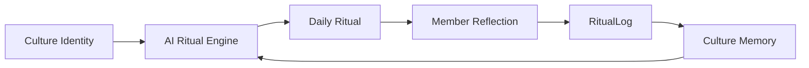

<div align="center">

# MICRO CULTURE

**Where communities don't just gather — they develop culture.**

An adaptive social platform where communities form their own rituals, language, identity, and evolving memory.

<br />

[](https://micro-culture.onrender.com)
[](https://github.com/tanmayyyyayyy/micro-culture)
[](https://micro-culture-api.onrender.com/health)

<br />

[Live Demo](https://micro-culture.onrender.com) • [Explore Cultures](https://micro-culture.onrender.com/explore) • [Architecture Overview](#-architecture--tech-stack) • [Local Setup](#-local-development-setup)

<br />

</div>

---

## The Idea

Most modern social platforms organize around an ephemeral, disposable pattern:

```
User  ──▶  Post  ──▶  Feed  ──▶  Disappear
```

**Micro Culture turns communities into evolving cultural systems.**

Instead of disposable content streams, communities are anchored by daily communal rites, a specialized lexicon, and cumulative shared memory:

```
Member
  │
  ▼
Ritual
  │
  ▼
Reflection
  │
  ▼
Memory
  │
  ▼
AI Adaptation
  │
  ▼
Next Ritual
```

---

> ### *"AI doesn't define the culture. The culture's history teaches the AI what comes next."*
>
> Micro Culture bridges persistent relational data with generative language models:
> - **MongoDB** stores persistent cultural state, sacred charters, and member reflection records.
> - **RitualLogs** capture verified participation and subjective reflection journals.
> - **Bounded Context** feeds recent history and participant lore into the ritual engine without leaking private user data.
> - **Groq API** synthesizes the next culture-specific ritual based on actual group momentum.
> - **Idempotent Persistence** records tomorrow's rite without overwriting cultural canon.

---

## 📸 Product Journey

| **1. Explore & Smart Discovery** | **2. Sacred Charter & Lore** |
| :---: | :---: |
| Browse living cultures filtered by *Trending*, *Active*, *New*, or *Growing*, with multi-field search across values, jargon, and aesthetic tags. | Inspect core values, founder traditions, specialized lexicon definitions, and communal progression metrics. |
| **3. Daily Ritual & Reflection** | **4. Sanctuary Dashboard** |
| Step-by-step sacred instructions, time estimates, and reflection journaling sealed directly into the culture's persistent memory. | Personal streak counters, member recognition tiers, and one-click access to today's active communal rites. |

*Experience the complete workflow live at [micro-culture.onrender.com](https://micro-culture.onrender.com).*

---

## 🧠 The AI Memory Loop

Micro Culture bridges persistent relational data with generative language models. Every culture maintains a sacred charter, a sequence of daily rituals, and a ledger of member reflections (`RitualLog`).



### The Six-Step Cycle
1. **Charter Formulation**: A founder provides a name, vibe keywords, and core ethos. The AI synthesizes an initial blueprint with cohesive aesthetic keywords, core values, a specialized jargon lexicon, and starter rites. Founders retain full editorial authority to edit or replace any term before committing to the database.
2. **Daily Rite Dispatch**: Each calendar day, the system lazily generates or retrieves the day's ritual for that culture.
3. **Member Participation**: Members review step-by-step instructions, complete the ritual, and submit a reflective journal entry (`RitualLog`). Server-side duplicate checks ensure exactly one log per member per ritual per day.
4. **Context Gathering**: The engine queries the culture's charter, the last 7 daily rituals, and the last 20 member reflection logs. Private user information is strictly excluded; only names and reflection thoughts are extracted.
5. **Memory-Informed Evolution**: The AI uses participant reflections to adapt difficulty, reinforce emerging inside jokes or jargon, and choose themes that build upon recent momentum.
6. **Chronicle Synthesis**: Weekly summaries distill member highlights and crown a "Rite of the Week" based on genuine participation.

---

## ✨ Key Features

### 🏛️ Culture Creation & Blueprints
- **AI-Assisted Blueprint Generation**: Formulates cohesive aesthetic descriptors, core values, specialized jargon dictionaries, and starter rites from a brief premise and vibe tags.
- **Full Review & Fine-Tuning**: Complete editorial control over generated values, jargon definitions, symbols, and descriptions prior to database commitment.
- **Custom Visual Identities**: Distinct color accents, custom emoji emblems, and curated aesthetic keywords for every culture.

### 🕯️ Daily Rituals & Member Reflections
- **Contextual Daily Rites**: Structured rituals with titles, durations, difficulty levels, reasonings, and reflective inquiries.
- **Interactive Checklists**: Interactive step-by-step sacred instructions with completion toggles.
- **Reflection Submissions**: In-browser reflection journaling with client and server character limits (up to 2,000 characters).
- **Duplicate Completion Protection**: Calendar-day idempotency guards return `409 Conflict` on repeated submissions, preserving streak and progression metrics.

### 📈 Progression, Streaks & Recognition
- **Culture Progression System**: Evaluates real community activity (member count, ritual count, recent participation velocity) to classify cultures into stages (`SEED`, `SPROUT`, `BLOOM`, `ESTABLISHED`, `CANON`).
- **Participation Streaks**: Computes consecutive daily completion streaks derived purely from actual `RitualLog` calendar timestamps.
- **Member Recognition Tiers**: Awards participation milestones (`INITIATE`, `DEVOTEE`, `ACOLYTE`, `ELDER`) tied to verified ritual reflections.

### 🧭 Smart Culture Discovery
- **Multi-Field Search**: Instant keyword discovery searching culture names, descriptions, values, jargon terms, and aesthetic tags.
- **Dynamic Exploration Categories**:
  - `ALL`: Comprehensive directory ordered by overall vitality.
  - `TRENDING`: Cultures with high recent log velocity and momentum.
  - `NEW`: Recently founded communities.
  - `ACTIVE`: Consistently practiced cultures with active daily participation.
  - `GROWING`: Emerging communities expanding their member base.

### 🛡️ Security & Production Hardening
- **JWT Authentication & Rate Limiting**: Secure token-based authentication with bcrypt password hashing (10 salt rounds) and endpoint rate limiters.
- **Sanitized Production Errors**: 500 status codes suppress internal stack traces and database errors in production.
- **Dynamic CORS**: Multi-origin CORS support with trailing-slash normalization; wildcard `*` access is strictly prohibited.
- **Zero Secret Leaks**: All secrets and credentials reside strictly in environment variables; zero hardcoded tokens.

---

## 🛠️ Architecture & Tech Stack

```
microculture/
├── backend/                  # Node.js Express REST API
│   ├── config/               # Database connection & configurations
│   ├── middleware/           # JWT auth & rate limiters
│   ├── models/               # Mongoose schemas (User, Culture, DailyRitual, RitualLog)
│   ├── routes/               # Express endpoints (auth, cultures, ai, logs)
│   ├── scripts/              # Demo seeding (seedDemo.js, cleanDemo.js)
│   └── tests/                # Standalone Node regression test suites
├── frontend/                 # Single-Page React Application
│   ├── src/
│   │   ├── api/              # Axios HTTP client with auth interceptors
│   │   ├── components/       # UI building blocks (NavBar, Modals, Badges, Panels)
│   │   ├── context/          # React AuthContext
│   │   └── pages/            # Application views (Explore, CultureDetail, DailyRitual, Dashboard, CreateCulture)
│   ├── index.html
│   └── vite.config.js
└── README.md
```

| Layer | Technologies |
| :--- | :--- |
| **Frontend** | React 18, Vite, Tailwind CSS, React Router v6, Axios |
| **Backend** | Node.js, Express 4, Mongoose 8, JSON Web Tokens (JWT), bcryptjs |
| **Database** | MongoDB Atlas / Local MongoDB |
| **AI Engine** | Groq API (Server-side AI calls, structured JSON output, defensive parsing) |
| **Deployment** | Render (Web Service for Backend + Static Site for Frontend) |

---

## 🚀 Local Development Setup

### Prerequisites
- Node.js (v18 or higher)
- Local MongoDB instance or MongoDB Atlas URI
- Groq API key

### 1. Clone the Repository
```bash
git clone https://github.com/tanmayyyyayyy/micro-culture.git
cd micro-culture
```

### 2. Configure Backend Environment
```bash
cd backend
cp .env.example .env
npm install
```

Configure your `backend/.env` file:
```env
PORT=5001
MONGO_URI=mongodb://localhost:27017/microculture
JWT_SECRET=your_super_secret_jwt_key_minimum_32_characters
GROQ_API_KEY=gsk_your_groq_api_key_here
GROQ_MODEL=openai/gpt-oss-120b
CLIENT_URL=http://localhost:5173,http://localhost:5174
```

### 3. Configure Frontend Environment
```bash
cd ../frontend
cp .env.example .env
npm install
```

Configure your `frontend/.env` file:
```env
VITE_API_URL=http://localhost:5001
```

### 4. Run Development Servers
In the `backend` terminal:
```bash
npm run dev
```

In the `frontend` terminal:
```bash
npm run dev
```

Visit `http://localhost:5173` to explore the application locally.

---

## 🌱 Demo Data Seeding

To preview the platform with rich, pre-populated cultures, historical rituals, and member reflections:

```bash
cd backend
npm run seed:demo
```

This seeds:
- **Nocturne Lens** (🌙 Night photography & shadow hunting) — *Highly Active*
- **Sub Rosa Codex** (📚 Slow reading & marginalia exchange) — *Active*
- **Concrete Frequency** (🎧 Field recordists & acoustic observation) — *Growing*
- **Circuit & Solder** (⚡ Micro-controllers & tactile hardware) — *Newly Founded*

**Safety & Idempotency Features:**
- **Disabled in Production**: Explicitly rejects execution when `NODE_ENV === "production"`.
- **Strictly Idempotent**: Safe to run repeatedly; uses deterministic upsert keys without duplicating documents.
- **Cleanup Utility**: Run `npm run seed:demo:clean` to remove all demo records.

---

## 🧪 Verification & Testing

The backend includes zero-dependency, standalone regression test suites verifying core invariants:

```bash
cd backend

# 1. Core loop reliability & duplicate completion guards
node tests/core-loop.test.js

# 2. AI ritual prompt construction, bounded context & validation
node tests/ritual-engine.test.js

# 3. AI blueprint formulation & cliché detection
node tests/blueprint-quality.test.js

# 4. Multi-field search, activity metrics & discovery algorithms
node tests/discovery.test.js

# 5. Production safety & idempotency of demo seeding
node tests/demo-seed.test.js
```

To verify the production frontend build:
```bash
cd ../frontend
npm run build
```

---

## 📦 Production Deployment

### Backend Service (e.g. Render / Railway / Docker)
- **Root Directory**: `backend`
- **Build Command**: `npm install`
- **Start Command**: `npm start`
- **Host Binding**: Defaults to `0.0.0.0` on `process.env.PORT`.
- **Environment Variables**:
  - `PORT`: Server port (e.g., `5001`)
  - `HOST`: Server bind address (`0.0.0.0`)
  - `MONGO_URI`: MongoDB connection string
  - `JWT_SECRET`: Random 32+ character string
  - `GROQ_API_KEY`: Groq API key
  - `CLIENT_URL`: Production frontend URL (e.g., `https://micro-culture.onrender.com`)

### Frontend Static Site (e.g. Render / Vercel / Netlify)
- **Root Directory**: `frontend`
- **Build Command**: `npm run build`
- **Publish Directory**: `dist`
- **Environment Variables**:
  - `VITE_API_URL`: Production backend URL (e.g., `https://micro-culture-api.onrender.com`)
  - `VITE_GA_MEASUREMENT_ID`: Google Analytics 4 Measurement ID (`G-8LG06KBT5M`)

---

## 👤 Author

Developed by **Tanmay Jain** as an exploration in generative culture mechanics, adaptive AI memory architectures, and responsive full-stack product engineering.

- **GitHub**: [@tanmayyyyayyy](https://github.com/tanmayyyyayyy)
- **Repository**: [github.com/tanmayyyyayyy/micro-culture](https://github.com/tanmayyyyayyy/micro-culture)
